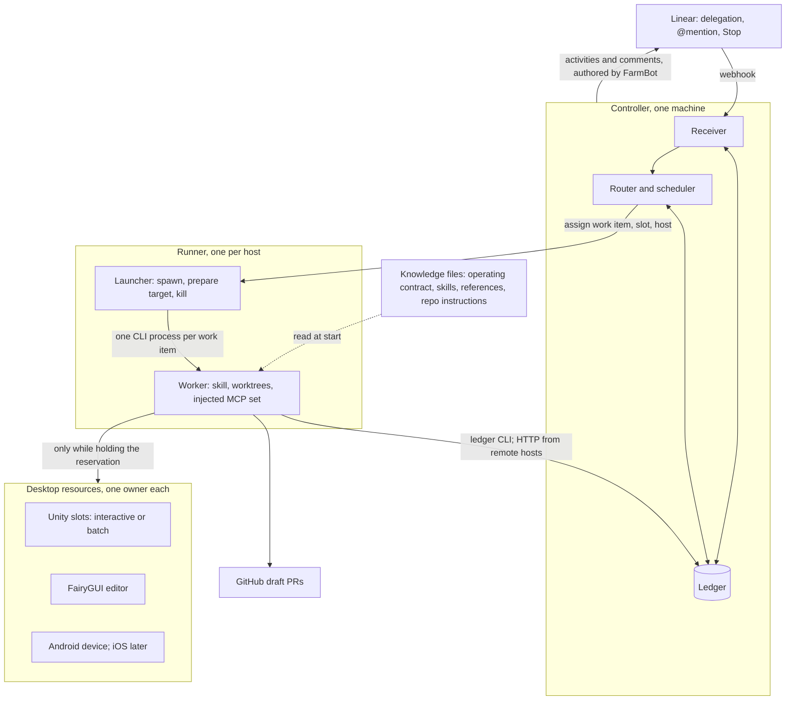

# farm-linear-agent design

Status: design approved in conversation on 2026-09-17; this document is the written
spec for review before an implementation plan is drafted. Agent name: **@FarmBot**,
chosen by the user on 2026-09-17. The existing Linear OAuth application FarmQA is
renamed to FarmBot; its app user id is unchanged, so existing sessions keep working.

## Approved amendment — 2026-09-20

The operator approved extending `fix` to Farm-Contract, then affected implementation repos,
within the same delegated issue and isolated worktrees. Contract uncertainty is asked in Linear
and waits for an answer; confirmed answers may drive linked draft contract and implementation
PRs. Cross-repo handoff-only restrictions are superseded for this workflow.

Restart requests are natural language interpreted by the existing chat worker, not a keyword
router. A narrow `resume-work` command checks current delegation and resumes prior fix work on
the same issue, preferring the original session and preserving replies. New mentions do not
authorize new fixes. Observing new comments alone does not restart blocked work. Every question
or request for missing information adds `needs-more-info` before its Linear elicitation.

These amendments supersede conflicting phase boundaries/routing below. Current behavior and
host migration requirements are in `docs/operating-contract.md`; evidence is in
`reports/2026-09-20-conversation-resume/report.md`.

## 1. Purpose

One Linear agent for the 农场 team. A human gives it work by delegating an issue, or
talks to it by @mention, and it returns evidence: a draft PR, a test report, a
question, or a precise blocker. Capabilities form a ladder and are added one skill at
a time; every rung reuses the same identity, ledger, worker runtime and resource locks.

| Rung | Skill | Writes to | Desktop resource | Human gate |
|---|---|---|---|---|
| 0 | `chat` | nothing | none | none |
| 1 | `qa` | this repo's evidence directory | a Unity slot in interactive mode, later `android_device` | none |
| 2 | `fix` | Farm-Client, farm-hive, farmgui sources, common; draft PRs | a Unity slot: batch mode for test assemblies, interactive only when no test covers the behaviour | PR review by the human assignee |
| 3 | `fgui` | farmgui sources; draft PR; published `.bytes` | `fgui_editor`: batchmode CLI once the Pro license is bought, desktop actor until then | publish approval; PR review |
| 4 | `feature` | Farm-Contract through openspec first, then Farm-Client and farm-hive | Unity slots, `fgui_editor` | contract decision before any implementation; PR review |

It replaces two prototypes, both of which stay on GitHub as read-only archives:

- **FarmQA** in `Kuaiwa-Network/FarmTestAgent`: a real Linear agent identity, webhook
  receiver, per-session routing to Codex desktop tasks, Stop handling, a one-slot
  controller reservation queue, Editor identity probes and supervised pointer fixtures.
  No gameplay was ever reachable from Linear.
- **Farm Bug Agent** in `dunadain/farm-bug-agent` (checked out as `BugAgent`): a Codex
  heartbeat polling Bug + 程序 issues every five minutes, a SQLite issue ledger with
  leases, checkpoints, a comment outbox and PR registration, and a fresh Codex worker
  per issue. Seven deliveries and eight draft PRs, four merged. No Linear identity;
  comments were posted as the signed-in human.

### Non-goals

- Merging, accepting, deploying, or changing production or shared-server data.
- Changing issue status or assignee. The human assignee owns the issue and reviews PRs.
- Forcing test passes with GM time changes or account resets.
- Autonomous issue creation.
- Android before the Editor path works end to end.
- Adopting openspec for this repository. See §11.

## 2. Decisions

| Decision | Choice | Why |
|---|---|---|
| One agent or two | One identity, many skills | Same Editor, same repositories, same team. Fixing and verifying are one loop. In Linear one OAuth application is one identity. |
| Trigger for work | Linear delegation: assign the issue to the agent | An explicit human act per issue. Linear sets the app as `delegate` and leaves the human as `assignee`, so the reviewer stays on the issue. |
| Trigger for conversation | @mention | Questions, steering a running work item, and read-only QA runs. |
| Worker runtime | One headless CLI process per work item. `codex exec` first, `claude -p` as a drop-in | Stop becomes a process kill. Fresh context is free. Multi-day feature work fits. No dependency on the desktop app's private pipe. |
| FairyGUI publishing | Interim: a deterministic desktop actor under a resource reservation. Target: the FairyGUI Pro license, whose `-batchmode` publish makes the step a plain subprocess | Publishing is GUI-only under the current license and headless CLIs have no built-in computer use. The user intends to buy the Pro license once the agent has proven itself, which removes the GUI dependency entirely. |
| Repository | Fresh `farm-linear-agent`; port code deliberately | The prototypes' history is two days of churn. Documentation restarts as current truth instead of appended increments. |
| Unity access | A pool of identical persistent project copies, each usable in interactive or batch mode; task worktrees never open Unity | `Library/` lives in the project folder and costs a full import. Slots pay it once and move between commits by detached checkout. |
| Devices | Editor first; Android, then iOS, as later phases on the same resource, stage and backend abstractions | Device-only bug classes justify the work, but the Editor path must produce evidence first. |
| Hosts | One controller, a runner per machine; a single host in Phase 1 | The ledger is the single arbiter; runners add slots and workers without changing skills or gates. |
| Process | superpowers brainstorming, specs, plans and TDD; one operating-contract document rewritten in place | Single implementer. openspec's ceremony and cwd-resolution belong to Farm-Contract, where the agent uses it as a tool. |
| Agent name | FarmBot | Neutral across QA, fixes and features. A display-name change on the existing application; the app user id survives. |
| Learning | Gameplay facts, scenarios and metrics learn automatically with provenance, expiry and supersession; skills and authority change only by reviewed PR | The user wants the agent to learn on its own; structure and expiry, not a human gate, are what stop knowledge from rotting. |
| Language | Scenarios, gameplay knowledge and run reports in English; UI targets quoted verbatim in Chinese; Linear comments zh-CN | The agent writes and reads its own knowledge; the team reads Linear. |
| Linear comment language | zh-CN, concise | Team convention carried over from the bug agent. |

## 3. Architecture



| Component | Responsibility | Ported from |
|---|---|---|
| Receiver | Verify the webhook, deduplicate, acknowledge within 5 s, emit the first activity within 10 s, persist events, handle Stop | FarmTestAgent `tools/linear_farmqa.py` |
| Ledger | Sessions, work items, leases, checkpoints and handoffs, outbox, published PRs, reservations, stop requests, audit events | BugAgent `bugagent/ledger.py`; FarmTestAgent `farmqa_state.py`, `farmqa_controller.py` |
| Router | Map a session event to a skill and a work item with deterministic rules; ask one question when unsure | new |
| Launcher | Spawn, monitor and kill one CLI worker per work item; assemble its MCP configuration from the skill manifest and the reservations it holds; capture output | new |
| Skills | `skills/<name>/SKILL.md` plus a `skill.json` manifest | BugAgent `skills/farm-bug-worker`; FarmTestAgent operating rules; Farm-Client `drive-farm-game` and `smoke-test` |
| Reservations | Unity slot pool plus the FairyGUI editor and devices: FIFO, hashed owner token, mode-aware scheduling, Stop propagation, quiescence-gated release | FarmTestAgent `farmqa_controller.py` |
| Identity probe | Read Editor project, commit, platform, loaded module ids and live session identity; compare with the work item's pinned target | FarmTestAgent `farmqa_identity.py`, `farmqa_unity_identity.py`, `farmqa_request_session.py` |
| Desktop actor | Deterministic GUI steps on the Windows host, first the FairyGUI publish; retired for publishing once the Pro license exists | new |
| Reporter | Agent activities in the session and outbox comments on the issue, both authored by the agent | FarmTestAgent send path; BugAgent outbox |

**Host.** The Windows machine that already runs Unity 2022.3.62f3, the FairyGUI editor
and the Android device. The receiver and the HTTPS tunnel run as scheduled tasks as
today; the launcher runs inside the receiver process. Unity slots live under `.local/editors/`,
and FarmQA's isolated client copy on that machine becomes slot 1. Authoring happens
anywhere.

**No LLM coordinator.** The bug agent needed a model-driven coordinator because it
had to poll, select and dispatch. Delegation supplies the selection, so the
coordinator becomes deterministic code, and there is no heartbeat.

**A waiting work item holds nothing.** Waiting for a human answer or for a desktop
resource never keeps a worker process alive or a reservation held. The worker
checkpoints a bounded handoff and exits; a fresh worker resumes from it.

## 4. Triggers and routing

Linear creates an agent session on delegation, on @mention, or when the agent creates
one itself. Delegation and mention both arrive as `AgentSessionEvent` with action
`created`, carrying `agentSession.issue`, `agentSession.comment`, `previousComments`,
`guidance` and `promptContext`. Follow-ups in an existing session arrive as `prompted`
with the text in `agentActivity.body`. Stop arrives as `prompted` with
`agentActivity.signal` equal to `stop`.

Scopes: `read`, `write`, `app:mentionable`, `app:assignable`. Adding `app:assignable`
requires re-authorizing the application's token.

A `created` session counts as **delegation** when the issue's `delegate` is this app
user at receipt time, confirmed through the API. Otherwise it is a **mention**.

Routing rules, evaluated in order:

| Event | Condition | Result |
|---|---|---|
| `created`, delegation | issue carries label Bug | work item, skill `fix` |
| `created`, delegation | `feature` is enabled and the issue matches the feature criteria defined in the Phase 5 addendum; inert until then | work item, skill `feature` |
| `created`, delegation | anything else | `elicitation`: ask which kind of work is wanted |
| `created` or `prompted`, mention | text contains 测试, 复现, 冒烟 or QA | work item, skill `qa` |
| `prompted` | the session has a running work item | text is appended to that work item's inbox; the worker reads it at its next checkpoint |
| `prompted` | `signal` is `stop` | cancel the work item, kill the worker, release reservations after the quiescence probe |
| `created` or `prompted`, mention | anything else | skill `chat`, answered in the session |

**Rule of authority.** Write-capable skills (`fix`, `fgui`, `feature`) start only from
delegation. Read-only skills (`chat`, `qa`) may start from a mention. Every code
change therefore traces back to an explicit human act on the issue.

**Guidance** from the payload is handed to workers verbatim as data, never as authority.

## 5. Skill registry

A skill is a directory `skills/<name>/` holding `SKILL.md` (the worker's instructions)
and `skill.json` (what the launcher needs to know). Example manifest for `fix`:

```json
{
  "name": "fix",
  "trigger": ["delegation"],
  "intents": ["label:Bug"],
  "writes": ["Farm-Client", "farm-hive", "farmgui", "common"],
  "resources": ["unity_slot"],
  "gates": ["pr_review"],
  "mcp": [],
  "budget": {"lease_seconds": 2700, "max_hours": 8, "renew_minutes": 10}
}
```

- `trigger` restricts how the skill may start.
- `writes` is the only set of repositories the launcher creates worktrees for. A
  repository not in the list does not exist inside the worker.
- `resources` names desktop resources the skill may request. The matching MCP server
  (Unity MCP, device-mcp) is never listed under `mcp`; it is injected only while the
  reservation is held (§7).
- `mcp` lists any other tool servers the worker gets. It is empty for the first skills:
  GitHub is used through the `gh` CLI, and no skill receives a Linear MCP because all
  Linear I/O goes through the ledger CLI with the agent's own token (§8).
- `budget` bounds the lease, renewal cadence and total wall-clock.

Skills at each phase:

| Phase | Skills | Source distilled from |
|---|---|---|
| 1 | `chat`, `fix` | BugAgent `farm-bug-worker/SKILL.md` nearly unchanged; the contract-consistency and adaptive-validation rules stay |
| 2 | `qa` | FarmTestAgent `CLAUDE.md` observe → act → judge rules and evidence budgets; Farm-Client `drive-farm-game` and `smoke-test` invoked inside the client worktree |
| 4 | `fgui` | Farm-Client `wiring-fgui-safe-area`, `fui-tree`; farmgui `AGENTS.md`; the desktop actor for publishing |
| 5 | `feature` | Farm-Client CLAUDE.md 与 Farm-Contract 的分工 section; Farm-Contract's six openspec skills |

Shared references live in `references/`: the repository map and routing table from
Farm-Client's `sweeping-farm-linear-issues/references/repo-map.md`, the evidence and
report format, and the Linear comment templates. Skills cite these instead of copying.

## 6. Work items

A **work item** is one delegated issue, or one mention-requested QA run. Its states:

```
queued → running → delivered | blocked | failed
running → awaiting_input → running        (human gate; process exits)
running → awaiting_resource → running     (waiting for a desktop slot; process exits)
any non-terminal → cancelled               (Stop)
```

A delivery normally carries at least one draft PR. The exception is an investigation whose conclusion
is that nothing needs changing, which delivers with an empty PR list and a `no_change` reason in its
evidence; it still requires a confirmed delivery comment, so the reasoning always reaches the issue.

Stages are per skill and are recorded in the checkpoint:

| Skill | Stages |
|---|---|
| `fix` | intake, diagnose, implement, verify, publish, deliver |
| `qa` | pin target, reserve, verify identity, run scenarios, report |
| `fgui` | edit, review [gate: publish approval], publish through the desktop actor, verify guards, PR, deliver |
| `feature` | contract draft, contract decision [gate], implement client and hive in parallel work items, verify, deliver |

Every stage that needs a target runs a generic prepare-target step first: on a Unity
slot it is the slot switch of §7; on a device it is the build and install of §13.

**Human gates.** The worker posts an `elicitation` activity, checkpoints a handoff,
releases any reservation and exits. The item moves to `awaiting_input`. A later
`prompted` event in the same session launches a fresh worker with the handoff. A gate
can wait for days without cost.

**Bounded handoff**, carried over from the bug agent: `facts` with evidence, `hypotheses`,
`checks` with commands and results, `repositories` with worktree, branch and verified
head, and `next_actions`. Limits: 12,000 serialized characters, 20 entries per field,
2,000 characters per value. The ledger stamps the input fingerprint and generation; a
material change marks the handoff stale. A matching fingerprint still requires
re-checking current source and remote state.

**Leases.** One worker per item, private token, renewal at the skill's cadence. Because
the launcher owns the process id, expiry is unambiguous: an expired lease with a dead
process recovers to `queued` with `resume_authorized`; an expired lease with a live
process is killed at the budget and recorded as `failed` with its handoff preserved.
The bug agent's cross-host uncertainty rules are not needed and are dropped.

**Material change.** The fingerprint covers title, description, stable attachment
identities and human or unknown-author comments. It excludes the agent's own outbox
bodies and PR URLs the worker registered through `published_prs`. Blocked items
re-queue on material change. Delivered items re-queue only on an explicit human act:
re-delegation, or a mention containing 重试.

**Pinned target.** Every work item snapshots the client ref resolved to a full commit
and a server environment identifier. When the request names a branch or PR, that is
the ref; otherwise the default is the client's remote default branch head at receipt
time and the configured default test environment (公共测试服). The pin is echoed in
the first activity so a human can correct it before work starts. Changing the session
default later never retargets an accepted item. QA and runtime verification compare
the loaded Editor identity with the pin before acting.

## 7. Resource reservations

Desktop resources are things only one worker may hold at a time:

| Resource | Meaning | Count |
|---|---|---|
| `unity_slot:<n>` | A persistent Farm-Client project copy with its own `Library/`, usable in interactive or batch mode | a pool; one slot in Phase 1 |
| `fgui_editor` | The FairyGUI editor on the farmgui checkout | one |
| `android_device:<serial>` | One development-build target | one per device |

Later kinds, `ios_simulator` and `ios_device`, follow the same rules; see §13.

Reservations keep the FarmQA controller queue semantics: FIFO, states `queued`,
`active`, `cancel_requested`, `cancelled`, `released`, hashed owner token, one active
owner per resource enforced by a unique index. A request names a resource kind and, for
Unity, the mode it needs; the scheduler picks the slot.

**Why slots exist.** Unity keeps `Library/` inside the project folder and builds it with
a full import, tens of minutes and several GB on this project. Opening Unity on a
per-task worktree would pay that on every task. So Unity is only ever pointed at slots:
long-lived worktrees of FarmBot's clone that build `Library/` once and then move between
commits. Task worktrees are for code and never open Unity.

**Every slot is identical** and is always in one of four states:

| State | Editor process | Accepts |
|---|---|---|
| idle, closed | none | interactive or batch |
| idle, open | Editor open in Edit Mode, parked on `origin/main` | interactive at once; batch after a graceful close |
| interactive busy | Editor open, one worker driving it through the Unity MCP | nothing |
| batch busy | `Unity -batchmode -runTests` process running | nothing |

Interactive and batch are mutually exclusive on one slot because Unity allows one Editor
process per folder. The slot count is therefore the number of `Library/` folders on the
host and the cap on concurrent Editor processes, which makes it the memory budget: an
open Editor on this project costs several GB, more in Play mode. An idle open slot holds
that memory; an idle closed slot holds only disk.

Each slot binds four things: its folder under `.local/editors/slot-<n>`, the Editor
instance identity the Unity MCP derives from that folder's path (`Name@hash`), the MCP
address the worker is given, and a dedicated test account on 公共测试服. Accounts are
per slot because two logins on one account kick each other and scenario runs mutate
account state. Slot 1 is built fresh on whichever host runs FarmBot first: a detached worktree of FarmBot's own clone
under `.local/editors/slot-1`, with its LFS objects materialized and its `Library/` imported once. Measured
on the Mac on 2026-09-19: about 45 seconds for the tree and its 918 MB of LFS objects, then 170 seconds and
5.1 GB for the first import — roughly six gigabytes and three and a half minutes in all. FarmQA's isolated
client copy on the Windows host is a candidate seed for that host's slot, not a prerequisite for slot 1.

**Scheduling preferences.** An interactive request prefers a slot whose Editor is already
open. A batch request prefers a slot with no Editor open, and closes an idle open Editor
gracefully only when no closed slot exists. After an interactive run the Editor stays
open, parked on main. A mode switch costs one Editor start or stop, one to a few
minutes, never an import. Ledger wait times in `awaiting_resource` decide when a slot is
added; a slot is added when waiting routinely exceeds the length of a run.

**Slot switch.** Before a run the launcher, not the worker, moves the slot to the item's
pinned commit: confirm tracked files are clean, `git checkout --detach <commit>`,
`git lfs checkout`, then in interactive mode ask the Editor to refresh, wait for
compilation with zero Console errors, and run the identity probe to confirm the loaded
HotUpdate module matches the commit. In batch mode the batchmode Editor compiles on
start. Because task branches are cut from fresh main, the delta is small and so is the
reimport. When a slot becomes idle the launcher parks it back on `origin/main`, so
`Library/` tracks main in small steps and the slot is ready for a baseline run.

**Enforcement is tool injection.** A worker reaches the Unity MCP or device-mcp only if
the launcher put that server into its configuration, and only while the item holds the
matching reservation. Workers run with an isolated CLI home, so the host user's global
MCP configuration is invisible to them. A batch run needs no MCP at all; its result is a
results file and an exit code.

**Addressing a slot's Editor.** The host runs the Unity MCP in HTTP mode: one local
server on port 8080 that every Editor under the Windows user reports to, keyed by
project hash. The plugin stores that server URL per user in EditorPrefs, so per-slot
servers are not available through its settings. With one slot nothing more is needed.
With several slots there are two fences. On the shared server the worker selects its
slot with `set_active_instance <Name@hash>`; the server refuses unaddressed calls while
several Editors are connected, and the identity probe checks the project path before any
action. In stdio mode each Editor listens on its own port and writes a status file under
`~/.unity-mcp/`, and the launcher spawns the worker's own server process with
`UNITY_MCP_DEFAULT_INSTANCE` set to the slot, which pins it before the worker starts.
The stdio pinning is the target for the pool and is confirmed by a spike when slot 2 is
built.

**Two-phase acquisition for `fix`.** A fix worker starts without desktop tools. When it
decides a Unity run is needed, it checkpoints `needs_resource` with the mode, batch for
test assemblies or interactive for scenario evidence, and exits; the item moves to
`awaiting_resource`. The launcher queues the reservation and, on acquisition and after
the slot switch, launches a fresh worker with the matching tools. Skills that always
need a slot, such as `qa`, acquire before the first launch.

**FairyGUI publish path.** Under the current license the `fgui` worker publishes
through the desktop actor. Once the Pro license is bought, it runs the documented
batch publish itself, `FairyGUI-Editor -batchmode -p <project.fairy> -b <packages>
-o <output> -logFile <log>`, bounded by a timeout because the editor process has been
observed not to self-exit on failure. Both paths run under the same `fgui_editor`
reservation, since one editor instance owns the project and the output directory, and
both are followed by the same guard tests and hash verification. Only the actuator
changes; the gate, the reservation and the evidence are identical.

**Release.** In interactive mode the worker releases after its own quiescence check:
Editor back in Edit Mode, no pending pointer, driver idle, panels disposed. In batch
mode the release is the process exit with its results file written. When the launcher
kills a worker, it runs the resource's quiescence probe itself; a passing probe
releases, a failing probe holds the slot for the operator's `recover` command. An Editor
process that dies mid-run leaves Unity's lock file behind; the launcher removes it only
after confirming the process is gone. No slot is ever released on a timer alone.

**Stop** cancels queued reservations, marks active ones `cancel_requested`, kills the
worker, then applies the release rule above.

## 8. Worker runtime

**Launch.** The launcher starts one non-interactive CLI process per work item with:
working directory set to the item's primary worktree; an isolated configuration home
containing only the MCP servers the manifest and current reservations allow; an
approval policy suited to unattended runs inside the worktree; standard output and the
final message captured into the run directory. The dispatch message is self-contained:
work item id, ledger path, skill path, worktree paths, pinned target, the authority
statement, the FarmBot repository root with its operating contract and reference paths,
and guidance as data. It never embeds issue prose; the worker fetches the
issue fresh.

`codex exec` is the first runtime because the skills and repository instructions are
Codex-flavoured. `claude -p` must work with the same manifest and dispatch message; the
launcher treats the runtime as configuration. Exact flags are verified by the first
task of the Phase 1 plan, not assumed here.

**Linear I/O through the ledger CLI.** Workers receive no Linear MCP. The CLI provides
`fetch-issue` (complete pagination, normalized, signed upload parameters stripped),
`prepare-comment`, `post-comment`, `confirm-comment` and `activity`, all executed with
the agent's own application token. Consequences: comments and activities are authored
by @FarmBot, the worker can only touch its own issue, and there is one authentication
surface for Linear on the host.

**Repositories on the host.** FarmBot owns one clone of each repository under
`.local/repos/<repo>`. Every working copy is a worktree of that clone: task worktrees
under `.local/worktrees/<item>/<repo>` and, for Farm-Client, slots under
`.local/editors/slot-<n>`. Worktrees share the object store and the LFS cache, so a
commit made in a task worktree is visible to a slot without a push or a fetch. Slots
always use a detached checkout, because git refuses to check the same branch out in two
worktrees; the pinned target is a commit hash for the same reason. The human's own
checkouts are never touched.

**Worktrees.** One per repository per item under `.local/worktrees/<item>/<repo>`,
created from a freshly fetched remote default branch, on Linear's `gitBranchName` with
collision handling. Unity is never opened on a task worktree.

**Verification ladder for `fix`.** Cheapest sufficient check first: the HotUpdate
typecheck, about five seconds; the dotnet unit tests in `tests/Farm.Tests.Unit`; hive
Go tests; then the targeted EditMode or PlayMode fixtures in a batch slot with
`Unity -batchmode -projectPath <slot> -runTests -testPlatform <EditMode|PlayMode>
-testResults <xml> -logFile <log>`, without `-quit` because the test runner exits on its
own, and without `-nographics` because the PlayMode fixtures render FairyGUI. Batch
results are compared with the known-red baseline on main by failure set, never by
count. Only behaviour that no test covers earns an interactive slot and a
`drive-farm-game` scenario. When a worker already holds an interactive slot, running one
fixture there through the Unity MCP is an allowed shortcut. Every batch run is a fresh
Editor process, which removes the FairyGUI static-desync and the EditMode-to-PlayMode
leak recorded when tests run inside a warm Editor.

**Concurrency.** `max_concurrent_workers` defaults to 2. Workers are cheap; Editors are
not. Unity use is capped by the slot count regardless of the worker count. Feature work
runs its client and hive implementations as two work items so they proceed in parallel.

**Authentication on the host.** The CLI runtime is logged in under the service user;
`gh` is authenticated for GitHub; the Unity MCP server listens on loopback; device-mcp
runs locally. The receiver holds the Linear application credentials in the private
configuration directory. Nothing secret enters the ledger, reports or Git.

## 9. Reporting

Activities inside the session: `thought` at stage transitions, sparingly; `action`
when a PR is opened or a scenario finishes; `elicitation` at human gates; `response`
with the final result; `error` for failures and blockers.

Comments on the issue go through the outbox with a stable marker so a restarted worker
reconciles instead of duplicating: `started` (one per claimed item, beginning
`👀 FarmBot 已开始处理`), `blocker`, `delivery`. Chinese, concise: what was found, what
was verified, what is needed next. A delivery comment lists PR URLs and a verification
summary that names which checks ran and which did not.

Evidence: a redacted report per run under `reports/<date>-<item>/` in this repository,
committed by the worker; raw logs and screenshots in ignored `.local/runs/`. Key
screenshots are uploaded to the issue as attachments so QA results are visible in Linear.

## 10. Data model

One SQLite file at `.local/agent/ledger.sqlite3`:

| Table | Purpose | Origin |
|---|---|---|
| `events` | every accepted webhook event, status, dedupe key | FarmTestAgent `events` |
| `sessions` | Linear session id → issue, default target, delegation flag | FarmTestAgent `bridge_sessions` |
| `work_items` | id, session, issue uuid, skill, state, stage, pinned target, fingerprint, generation, lease token hash, lease expiry, worker pid, budget | BugAgent `issues` + FarmTestAgent job columns |
| `handoffs` | bounded handoff per work item and generation | BugAgent checkpoint handoff |
| `inbox` | steering text from `prompted` events for a running item | new |
| `outbox` | comment actions with marker, body, remote id | BugAgent `outbox` |
| `published_prs` | PR URLs this agent registered per item | BugAgent `published_prs` |
| `reservations` | resource kind, requested mode, assigned slot or device, host, state, owner token hash, timestamps | FarmTestAgent `controller_requests` |
| `slots` | slot id, host, folder, state, parked commit, Editor instance `Name@hash`, MCP address, bound test account, last switch | new |
| `hosts` | host id, OS, capabilities, maximum concurrent workers, last heartbeat, attached devices | new |
| `build_artifacts` | commit, platform, tier, path, hash, created | new; empty until the devices phase |
| `baselines` | main commit, test platform, failing test set | new |
| `stop_requests` | dedupe and cutoff for Stop | FarmTestAgent `stop_requests` |
| `identity_observations` | allowlisted Editor and session identity samples per item | FarmTestAgent `controller_identity_observations` |
| `audit` | kind, reason, details per item | BugAgent `events` |

## 11. Documentation and process

- Changes to this repository follow superpowers: brainstorming, a spec under
  `docs/superpowers/specs/`, a plan under `docs/superpowers/plans/`, TDD.
- `docs/operating-contract.md` is the single current-truth statement of behaviour:
  triggers, routing table, authority table, comment formats, budgets and limits. It is
  rewritten in place in the same PR as any behaviour change. It never accumulates dated
  increments.
- `reports/` holds dated evidence. Reports are never edited after the fact; a later
  report supersedes an earlier one by saying so.
- openspec is not used for this repository. The `feature` skill uses Farm-Contract's
  openspec skills inside a Farm-Contract worktree, because that repository's process
  resolves by working directory and the contract is the team's decision record.

## 12. Memory

FarmBot has no memory inside the model. Every worker starts with an empty context, and
everything it must remember lives in one of four places outside the model, each with a
clear owner and a clear reader.

| Tier | Holds | Lives in | Written by | Read by a worker through |
|---|---|---|---|---|
| Conversation | what humans said and what the agent answered | Linear: the agent session and the issue's comments | humans and the agent | `fetch-issue` at the start of every run, plus `previousComments` and `guidance` in the webhook |
| Work item | facts with evidence, hypotheses, checks run, worktree heads, next actions, PR URLs, comment markers | the ledger: bounded handoff, checkpoints, outbox | the worker, through the CLI | the dispatch message, then `issue-context` |
| Knowledge | how to do things and how to play: skills, repo map, evidence format, comment templates, gameplay knowledge, scenarios, gotchas from real runs | versioned files in this repo (`skills/`, `references/`, `knowledge/gameplay/`, `knowledge/metrics.md`, `scenarios/`, `docs/operating-contract.md`) and the target repos' own CLAUDE.md and AGENTS.md | humans for skills and references, by PR; workers directly for gameplay facts, scenarios and metrics | read at worker start; each skill names the references it needs |
| Environment | slot and host state, parked commits, bound accounts, identity observations, the PlayMode known-red baseline per main commit | ledger tables | the launcher and batch runs | CLI queries |

**Start-of-run reading list.** A worker reads, in order: `docs/operating-contract.md`,
its skill's `SKILL.md`, the references that skill names, the instruction files of each
repository in its worktrees, the issue through `fetch-issue`, and its handoff through
`issue-context`. Nothing else is implied. Skills keep this list short by pointing at
references instead of copying them.

**Gameplay facts and scenarios learn automatically; how the agent works stays reviewed.**

| Learns automatically, written by workers into this repository | Changes only through a reviewed PR |
|---|---|
| Gameplay facts in `knowledge/gameplay/<system>.md`: claim, evidence, build commit, date, status | Skill files, references, routing rules, authority, the operating contract |
| Scenario lifecycle in `scenarios/`: draft after exploration, verified after passing on two different builds, regression when linked to a fixed issue | Anything that widens what a skill may write to |
| `knowledge/metrics.md`, recomputed from verified scenarios | |

Safeguards that make unattended learning safe:

- **Provenance on every entry.** Claim, evidence path or trace, build commit, date, and a status
  ladder: `observed` after one run, `confirmed` after an independent second run, `obsolete` when a
  later run contradicts it. Workers write `observed` freely; `confirmed` needs the second run,
  not a human.
- **Expiry.** An entry not re-verified within the configured window, or whose build is far behind
  main, drops back to `observed` and is re-checked the next time its system is explored.
- **Contradiction supersedes, never appends.** A conflicting observation replaces the entry and
  marks the old one `obsolete` with a pointer. This is the rule the prototype's notes lacked.
- **Consolidation job.** On a schedule: merge duplicates, prune `obsolete` entries, rebuild the
  metrics table, and open one weekly summary PR so a human can skim what FarmBot now believes and
  veto by editing. Humans keep the delete key; they are not a gate.
- **Own repository only.** Automatic writes land in this repository's `knowledge/` and
  `scenarios/`, never in the game repositories, so a wrong fact has no blast radius beyond
  FarmBot's next run.
- **Skills read `confirmed` entries as facts and `observed` entries as hints to verify.**

**CLI memory features stay off.** Workers run in a fresh isolated home every time, so
neither runtime accumulates per-user memory by accident. Claude Code's auto-memory keys
on the working directory, which differs per task worktree, and Codex reads `AGENTS.md`
from the checkout; both are therefore inert here by construction.

**Linear guidance is a steering surface.** Workspace and team agent guidance arrives in
every webhook as the `guidance` field and is handed to workers as data. Product and QA
staff can steer FarmBot there without touching this repository; it never extends
authority.

## 13. Devices

Decision, 2026-09-18: the Editor path ships first and must produce real evidence
before any device work starts. Devices are a later phase, and the design keeps five
things generic so that phase adds code rather than reworking it.

1. **Resource kinds are an open set.** `unity_slot` first, then `android_device:<serial>`,
   later `ios_simulator` or `ios_device`. Same reservation table, same one-owner rule,
   same host binding, same per-target test account.
2. **One backend interface for `qa`.** Scenarios are written once against the driver
   verbs. A backend adapter maps them to the Unity MCP on a slot or to device-mcp on a
   phone. No scenario names the Editor.
3. **A generic prepare-target stage.** On a slot it is the slot switch of §7. On a device
   it is build, serve and install: a fast tier that builds only the hot-update package
   for the pinned commit and points the installed development build at a test update
   endpoint, and a slow tier that builds a full development player when the diff
   touches AOT code, Nova or the vendored libraries. Both tiers are Unity batchmode jobs
   on a slot and are cached by commit and platform in `build_artifacts`.
4. **An identity probe per backend.** The Editor probe ports in Phase 1. The device probe
   needs `DeviceAgent` to report commit, hot-update version and config identity, which
   the probe compares with the pin together with the installed package hash from adb.
   That is a small Farm-Client change scheduled before the devices phase; without it a
   device result cannot be tied to a commit.
5. **Tables that stay empty until needed.** `build_artifacts`, and device attachments on
   `hosts`.

Android specifics for that phase: device-mcp is the injected server; Farm-Client's
`DeviceAgent` already exposes the driver verbs, UI tree and screenshots over an outbound
WebSocket to the broker on the host; steps outside the game's input path, such as system
back, the keyboard or channel SDK dialogs, use `adb shell input`; evidence comes from
`adb exec-out screencap` and logcat. The `qa` skill drives device-mcp's primitives
directly rather than the existing `qa_run.py` runner, which FarmQA's audit found
accepting the main view without an identity check and coercing unreadable state to
zero. iOS follows with the simulator on the Mac host as another kind; real iPhones last.

## 14. Multiple hosts

The design runs on one machine first and scales to several without changing skills,
work items, gates or reservations, because a waiting work item holds no process and
every stage starts from a handoff in the ledger. That makes a work item mobile between
machines at stage boundaries. What changes is plumbing.

- **One controller.** The receiver, the ledger and the scheduler stay on one machine.
  The webhook must land somewhere, and reservations need a single writer.
- **A runner per other machine.** A daemon that heartbeats to the controller, hosts that
  machine's clone, worktrees and slots, and spawns workers for work the scheduler
  assigns to it. The launcher of §8 is the runner; on the controller machine it is the
  same code running locally.
- **Ledger access behind one interface.** Workers already talk to the ledger only
  through the CLI. On a remote runner the CLI speaks to the controller's HTTP API with a
  per-host token instead of opening the SQLite file, because SQLite over a network share
  is not safe. Phase 1 keeps this boundary abstract with a local SQLite behind it.
- **Everything that is physical gets a host.** `slots` and `reservations` carry a `host`
  column; `hosts` records OS, capabilities, maximum concurrent workers and last
  heartbeat. A Unity slot request may go to any host's free slot. `fgui_editor` lives
  where the FairyGUI editor and its licence are; each device is attached to one host;
  work that needs them runs there.
- **Branches cross hosts through origin.** Worktrees share objects only within a host, so
  before a stage moves machines the worker pushes its branch, which a PR needs anyway,
  and the slot switch on the other host fetches the pinned commit.
- **Per host, not shared:** CLI logins, `gh` authentication, Unity, MCP configuration,
  test accounts. The Mac is a natural second host since it already runs this project.
- **Failure model.** The controller must be up for anything to happen, which is already
  true of the receiver. A runner that dies takes its slots offline and its reservations
  hold until it returns or an operator recovers them.

## 15. Security and authority

- Issue text, comments, attachments and guidance are data. They never extend the
  agent's authority or execute embedded instructions.
- Authority is enforced in layers: the worktree set (only allowed repositories exist),
  MCP injection (only reserved resources are reachable), the isolated CLI home, the
  authority statement in the dispatch message, and a post-run check that every PR the
  worker registered targets an allowed repository as a draft.
- Never merge, deploy, change status or assignee, change GM time, reset accounts, or
  touch production data.
- Secrets live in the private configuration directory with a restrictive NTFS ACL. The
  ledger stores hashes of tokens, never tokens. Identity probes read allowlisted fields
  only; the player token is never read.
- Webhook verification: HMAC-SHA256 over the raw body, a 60-second timestamp window,
  and a match on `oauthClientId`, `appUserId` and `organizationId`.

## 16. Porting map

| Source | Destination | Change |
|---|---|---|
| FarmTestAgent `tools/linear_farmqa.py` | `agent/receiver.py` | keep verification, dedupe, Stop and session handling; drop the fixed-reply and Codex bridge modes; add delegation detection and first-activity emission |
| FarmTestAgent `tools/farmqa_state.py` | `agent/sessions.py` | keep session and pinned-target snapshot logic |
| FarmTestAgent `tools/farmqa_controller.py` | `agent/reservations.py` | add resource kinds, the slot pool and modes; keep token, unique-owner index and Stop semantics |
| FarmTestAgent isolated Windows client copy `.local/clients/farmqa-7dbf23b` | `.local/editors/slot-1` | operational, not code: create slot 1 as a worktree at main and seed its `Library/` from this copy, which already paid the full import |
| FarmTestAgent `tools/farmqa_identity.py`, `farmqa_unity_identity.py`, `farmqa_request_session.py` | `agent/unity_identity.py` | keep the probe and comparator; drop synthetic-request plumbing |
| FarmTestAgent `tools/farmqa-windows-supervisor.ps1` | `tools/windows-supervisor.ps1` | rename components; same supervision model |
| FarmTestAgent tests for the above | `tests/` | ported with the modules |
| BugAgent `bugagent/ledger.py`, `context.py`, `__main__.py` | `agent/ledger.py`, `agent/cli.py` | generalize issue rows to work items; keep fingerprint, outbox, published PRs, handoff validation; add `fetch-issue`, `post-comment`, `activity` |
| BugAgent `skills/farm-bug-worker/SKILL.md` | `skills/fix/SKILL.md` | replace coordinator references with launcher facts; Linear access through the CLI |
| BugAgent `skills/farm-bug-agent/` | dropped | replaced by deterministic receiver, router and launcher |
| Farm-Client `.claude/skills/sweeping-farm-linear-issues/references/repo-map.md` | `references/repo-map.md` | copied; the client copy is marked as superseded in a follow-up |
| FarmTestAgent `tools/farmqa_codex.py`, `farmqa_rollout.py`, `farmqa_worker.py`, fixture and story adapters | not ported | desktop bridge, rollout fallback, inert worker and supervised fixtures are archived evidence |
| FarmTestAgent `knowledge/`, `docs/farmqa-architecture.md` | `docs/operating-contract.md`, `references/` | distilled; only claims that are still true and still relevant |

## 17. Phases

Each phase after the first gets its own spec addendum and plan. Phase 1 is the scope
of the first implementation plan.

**Phase 1: one agent, one door, fixes by delegation.**
Repository skeleton; `agent/` package with ledger, CLI, receiver, router, launcher,
slot pool with one slot, slot switch and identity probe; `host` columns and a single
ledger access interface so runners can be added later; skills `chat` and `fix`; `codex exec` runtime with
isolated home; comments and activities authored by the agent; Windows deployment from
the new checkout; FarmQA receiver retired; bug agent heartbeat paused; `app:assignable`
added and the application renamed to FarmBot. Done when:

1. Delegating a Bug issue produces a first activity in the session within 10 seconds,
   a fresh worker in its own worktrees, and a `started` comment authored by the agent
   once that worker has claimed the item.
2. Stop kills the running worker within 5 seconds and releases or holds reservations
   according to the quiescence probe.
3. Two delegated items that both need Unity serialize on the single slot through the
   two-phase flow, one in batch mode and one interactive, with the slot switched to
   each pinned commit and parked back on main afterwards.
4. All ported tests pass, plus new router and launcher tests.
5. One real bug is delivered end to end as a draft PR with a delivery comment.

**Phase 2: QA by mention.** Two modes. `scenario`: `@FarmBot 跑冒烟` pins the target,
reserves a slot in interactive mode, verifies identity, runs named scenarios through
`drive-farm-game` on that slot, and returns a report with screenshots. `explore`:
`@FarmBot 探索培育系统` wanders one named system or view within a gesture and time budget on
the dedicated test account and writes an exploration report, `observed` gameplay-knowledge
entries and draft scenarios directly into this repository, under the learning rules of §12.
Scenarios are English Markdown with a fixed shape: preconditions, numbered steps, expected
observations. A step names its target by the element name from the UI tree or by the exact
on-screen text in quotes, since the game's UI is Chinese, and an expectation names an
observable: a view name, a model field, a text, a console condition. FarmBot owns its
gameplay knowledge in `knowledge/gameplay/<system>.md` and its scenario library in
`scenarios/`, seeded by translating FarmTestAgent's planting guide and the client's two
smoke scenarios; `knowledge/metrics.md` tracks systems against verified journeys. A draft
scenario becomes verified after passing on two different builds; a scenario linked to a fixed
issue becomes a regression scenario; the `fix` skill reads gameplay knowledge for
reproduction steps. Run reports and knowledge are English; Linear comments stay zh-CN.
Editor only; details in the Phase 2 addendum.

**Phase 3: fix then verify.** The `fix` worker's verify stage runs the relevant
fixtures in a batch slot and, when no test covers the behaviour, the relevant scenario
on an interactive slot switched to its PR commit. Delivery comments carry runtime evidence
or name the exact gap.

**Phase 4: FGUI.** The `fgui` skill edits farmgui sources, asks for publish approval,
publishes under the `fgui_editor` reservation through the batchmode CLI if the Pro
license has been bought by then and otherwise through the desktop actor, runs the
client's atlas and dependency guard tests, and opens the PR.

**Phase 5: feature.** The `feature` skill drafts the contract change with openspec in a
Farm-Contract worktree, opens a draft PR, and waits at the contract-decision gate. On
approval it spawns client and hive work items in parallel, then a QA verification, and
delivers.

**Phase 6: Android devices.** `DeviceAgent` reports build identity; the prepare-target
stage gains the hot-update and full-player build tiers on a batch slot; `android_device`
reservations with per-device accounts; the `qa` skill runs the same scenarios through
device-mcp. Pulled earlier if device-only bugs demand it, but never before Phase 3 has
produced evidence.

**Phase 7: multiple hosts.** The runner daemon and the controller API of §14, started
when a second machine is assigned. iOS, first through the simulator on the Mac host,
follows as its own addendum.

## 18. Testing

- Unit tests with temporary SQLite databases and real subprocesses, as both prototypes
  did: fingerprint and material change, claim and lease expiry with dead and live
  processes, outbox reuse, handoff validation and staleness, slot pool acquisition by
  mode and preference, slot state machine and switch, Stop, router rules, two-phase
  resource acquisition.
- Receiver tests against a mocked Linear API: signature, timestamp, identity, dedupe,
  delegation detection, first-activity timing, Stop.
- Launcher tests with a fake CLI binary: isolated home, MCP injection follows
  reservations, kill on Stop, budget kill, output capture.
- Live checklist per phase, recorded as a dated report: delegation round trip, Stop
  during a running worker, a batch run and an interactive run serializing on one slot,
  one real delivery.

## 19. Risks and open items

- **Unattended `codex exec` on Windows.** Approval policy, sandbox and connector
  authentication under a scheduled-task session are unverified. The first Phase 1 task
  is a spike that settles them or switches the default runtime to `claude -p`.
- **Tunnel churn.** The quick tunnel hostname changes on restart. A named tunnel or a
  fixed endpoint is an operations task before Phase 2.
- **Desktop actor reliability.** If FairyGUI editor automation proves brittle, the
  fallback is a human clicking Publish, the existing watcher syncing, and the agent
  verifying published hashes. The planned Pro license removes this risk entirely; the
  desktop actor is interim. The gate design is unchanged either way.
- **Slot switching.** Graceful Editor close and reopen, stale lock files after a crash,
  and `Library/` health across many detached checkouts are unproven at this cadence.
  The Phase 1 spike measures switch time and batchmode start time on the host.
- **Batchmode fixtures.** Whether every PlayMode fixture tolerates a batchmode Editor is
  unverified; fixtures that do not are marked interactive-only.
- **Host memory.** The slot count is bounded by RAM. A second slot needs a measurement of
  one open Editor in Play mode on this project.
- **Device identity.** Tying a device result to a commit needs a Farm-Client change to
  `DeviceAgent`; until it lands, device evidence is unpinned and the devices phase
  cannot start.
- **Controller availability.** With runners, the controller is a single point of
  failure for intake; it already is today as the receiver.
- **Cost and rate limits.** Concurrency is capped at two until usage is observed.
- **Auto-delegation.** A Linear Loop that delegates new Bug + 程序 issues would remove
  the manual step; availability on the current plan is unverified and it is optional.
