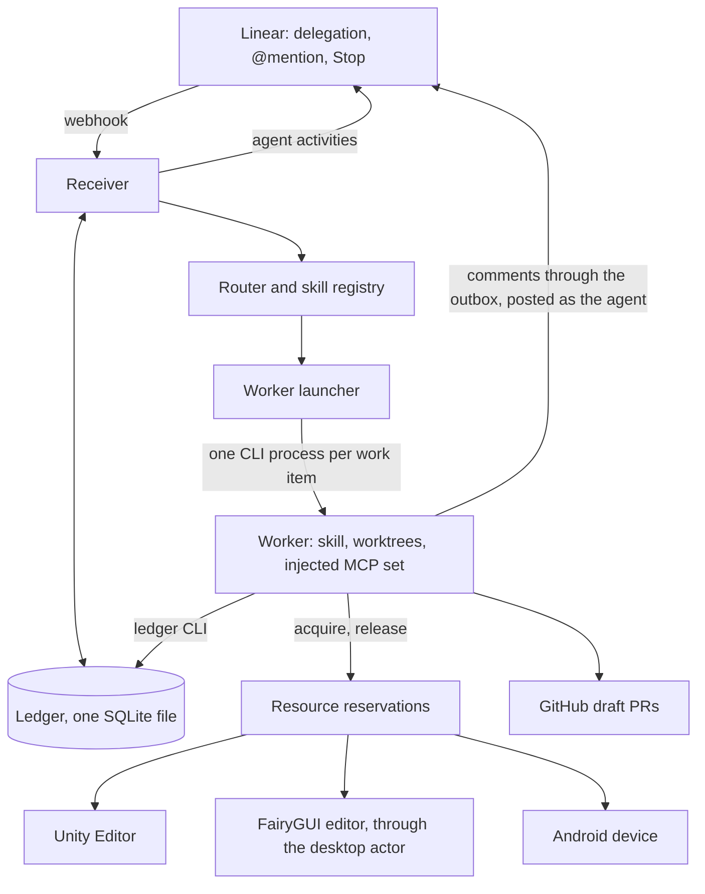

# farm-linear-agent design

Status: design approved in conversation on 2026-09-17; this document is the written
spec for review before an implementation plan is drafted. Agent name: **@FarmBot**,
chosen by the user on 2026-09-17. The existing Linear OAuth application FarmQA is
renamed to FarmBot; its app user id is unchanged, so existing sessions keep working.

## 1. Purpose

One Linear agent for the 农场 team. A human gives it work by delegating an issue, or
talks to it by @mention, and it returns evidence: a draft PR, a test report, a
question, or a precise blocker. Capabilities form a ladder and are added one skill at
a time; every rung reuses the same identity, ledger, worker runtime and resource locks.

| Rung | Skill | Writes to | Desktop resource | Human gate |
|---|---|---|---|---|
| 0 | `chat` | nothing | none | none |
| 1 | `qa` | this repo's evidence directory | `unity_editor`, later `android_device` | none |
| 2 | `fix` | Farm-Client, farm-hive, farmgui sources, common; draft PRs | `unity_editor`, only for runtime verification | PR review by the human assignee |
| 3 | `fgui` | farmgui sources; draft PR; published `.bytes` through the desktop actor | `fgui_editor` | publish approval; PR review |
| 4 | `feature` | Farm-Contract through openspec first, then Farm-Client and farm-hive | `unity_editor`, `fgui_editor` | contract decision before any implementation; PR review |

It replaces two prototypes, both of which stay on GitHub as read-only archives:

- **FarmQA** in `Kuaiwa-Network/FarmTestAgent`: a real Linear agent identity, webhook
  receiver, per-session routing to Codex desktop tasks, Stop handling, a one-slot
  controller reservation queue, Editor identity probes and supervised pointer fixtures.
  No gameplay was ever reachable from Linear.
- **Farm Bug Agent** in `dunadain/farm-bug-agent` (checked out as `BugAgent`): a Codex
  heartbeat polling Bug + 程序 issues every five minutes, a SQLite issue ledger with
  leases, checkpoints, a comment outbox and PR registration, and a fresh Codex worker
  per issue. Seven deliveries and eight draft PRs, four merged. No Linear identity;
  comments were posted as the signed-in human.

### Non-goals

- Merging, accepting, deploying, or changing production or shared-server data.
- Changing issue status or assignee. The human assignee owns the issue and reviews PRs.
- Forcing test passes with GM time changes or account resets.
- Autonomous issue creation.
- Android before the Editor path works end to end.
- Adopting openspec for this repository. See §11.

## 2. Decisions

| Decision | Choice | Why |
|---|---|---|
| One agent or two | One identity, many skills | Same Editor, same repositories, same team. Fixing and verifying are one loop. In Linear one OAuth application is one identity. |
| Trigger for work | Linear delegation: assign the issue to the agent | An explicit human act per issue. Linear sets the app as `delegate` and leaves the human as `assignee`, so the reviewer stays on the issue. |
| Trigger for conversation | @mention | Questions, steering a running work item, and read-only QA runs. |
| Worker runtime | One headless CLI process per work item. `codex exec` first, `claude -p` as a drop-in | Stop becomes a process kill. Fresh context is free. Multi-day feature work fits. No dependency on the desktop app's private pipe. |
| Desktop GUI steps | A deterministic desktop actor, run under a resource reservation | farmgui publishing is GUI-only under the project's editor license. Headless CLIs have no built-in computer use. |
| Repository | Fresh `farm-linear-agent`; port code deliberately | The prototypes' history is two days of churn. Documentation restarts as current truth instead of appended increments. |
| Process | superpowers brainstorming, specs, plans and TDD; one operating-contract document rewritten in place | Single implementer. openspec's ceremony and cwd-resolution belong to Farm-Contract, where the agent uses it as a tool. |
| Agent name | FarmBot | Neutral across QA, fixes and features. A display-name change on the existing application; the app user id survives. |
| Linear comment language | zh-CN, concise | Team convention carried over from the bug agent. |

## 3. Architecture



| Component | Responsibility | Ported from |
|---|---|---|
| Receiver | Verify the webhook, deduplicate, acknowledge within 5 s, emit the first activity within 10 s, persist events, handle Stop | FarmTestAgent `tools/linear_farmqa.py` |
| Ledger | Sessions, work items, leases, checkpoints and handoffs, outbox, published PRs, reservations, stop requests, audit events | BugAgent `bugagent/ledger.py`; FarmTestAgent `farmqa_state.py`, `farmqa_controller.py` |
| Router | Map a session event to a skill and a work item with deterministic rules; ask one question when unsure | new |
| Launcher | Spawn, monitor and kill one CLI worker per work item; assemble its MCP configuration from the skill manifest and the reservations it holds; capture output | new |
| Skills | `skills/<name>/SKILL.md` plus a `skill.json` manifest | BugAgent `skills/farm-bug-worker`; FarmTestAgent operating rules; Farm-Client `drive-farm-game` and `smoke-test` |
| Reservations | One slot per desktop resource, FIFO, hashed owner token, Stop propagation, quiescence-gated release | FarmTestAgent `farmqa_controller.py` |
| Identity probe | Read Editor project, commit, platform, loaded module ids and live session identity; compare with the work item's pinned target | FarmTestAgent `farmqa_identity.py`, `farmqa_unity_identity.py`, `farmqa_request_session.py` |
| Desktop actor | Deterministic GUI steps on the Windows host, first the FairyGUI publish | new |
| Reporter | Agent activities in the session and outbox comments on the issue, both authored by the agent | FarmTestAgent send path; BugAgent outbox |

**Host.** The Windows machine that already runs Unity 2022.3.62f3, the FairyGUI editor
and the Android device. The receiver and the HTTPS tunnel run as scheduled tasks as
today; the launcher runs inside the receiver process. Authoring happens anywhere.

**No LLM coordinator.** The bug agent needed a model-driven coordinator because it
had to poll, select and dispatch. Delegation supplies the selection, so the
coordinator becomes deterministic code, and there is no heartbeat.

**A waiting work item holds nothing.** Waiting for a human answer or for a desktop
resource never keeps a worker process alive or a reservation held. The worker
checkpoints a bounded handoff and exits; a fresh worker resumes from it.

## 4. Triggers and routing

Linear creates an agent session on delegation, on @mention, or when the agent creates
one itself. Delegation and mention both arrive as `AgentSessionEvent` with action
`created`, carrying `agentSession.issue`, `agentSession.comment`, `previousComments`,
`guidance` and `promptContext`. Follow-ups in an existing session arrive as `prompted`
with the text in `agentActivity.body`. Stop arrives as `prompted` with
`agentActivity.signal` equal to `stop`.

Scopes: `read`, `write`, `app:mentionable`, `app:assignable`. Adding `app:assignable`
requires re-authorizing the application's token.

A `created` session counts as **delegation** when the issue's `delegate` is this app
user at receipt time, confirmed through the API. Otherwise it is a **mention**.

Routing rules, evaluated in order:

| Event | Condition | Result |
|---|---|---|
| `created`, delegation | issue carries label Bug | work item, skill `fix` |
| `created`, delegation | `feature` is enabled and the issue matches the feature criteria defined in the Phase 5 addendum; inert until then | work item, skill `feature` |
| `created`, delegation | anything else | `elicitation`: ask which kind of work is wanted |
| `created` or `prompted`, mention | text contains 测试, 复现, 冒烟 or QA | work item, skill `qa` |
| `prompted` | the session has a running work item | text is appended to that work item's inbox; the worker reads it at its next checkpoint |
| `prompted` | `signal` is `stop` | cancel the work item, kill the worker, release reservations after the quiescence probe |
| `created` or `prompted`, mention | anything else | skill `chat`, answered in the session |

**Rule of authority.** Write-capable skills (`fix`, `fgui`, `feature`) start only from
delegation. Read-only skills (`chat`, `qa`) may start from a mention. Every code
change therefore traces back to an explicit human act on the issue.

**Guidance** from the payload is handed to workers verbatim as data, never as authority.

## 5. Skill registry

A skill is a directory `skills/<name>/` holding `SKILL.md` (the worker's instructions)
and `skill.json` (what the launcher needs to know). Example manifest for `fix`:

```json
{
  "name": "fix",
  "trigger": ["delegation"],
  "intents": ["label:Bug"],
  "writes": ["Farm-Client", "farm-hive", "farmgui", "common"],
  "resources": ["unity_editor"],
  "gates": ["pr_review"],
  "mcp": [],
  "budget": {"lease_seconds": 2700, "max_hours": 8, "renew_minutes": 10}
}
```

- `trigger` restricts how the skill may start.
- `writes` is the only set of repositories the launcher creates worktrees for. A
  repository not in the list does not exist inside the worker.
- `resources` names desktop resources the skill may request. The matching MCP server
  (Unity MCP, device-mcp) is never listed under `mcp`; it is injected only while the
  reservation is held (§7).
- `mcp` lists any other tool servers the worker gets. It is empty for the first skills:
  GitHub is used through the `gh` CLI, and no skill receives a Linear MCP because all
  Linear I/O goes through the ledger CLI with the agent's own token (§8).
- `budget` bounds the lease, renewal cadence and total wall-clock.

Skills at each phase:

| Phase | Skills | Source distilled from |
|---|---|---|
| 1 | `chat`, `fix` | BugAgent `farm-bug-worker/SKILL.md` nearly unchanged; the contract-consistency and adaptive-validation rules stay |
| 2 | `qa` | FarmTestAgent `CLAUDE.md` observe → act → judge rules and evidence budgets; Farm-Client `drive-farm-game` and `smoke-test` invoked inside the client worktree |
| 4 | `fgui` | Farm-Client `wiring-fgui-safe-area`, `fui-tree`; farmgui `AGENTS.md`; the desktop actor for publishing |
| 5 | `feature` | Farm-Client CLAUDE.md 与 Farm-Contract 的分工 section; Farm-Contract's six openspec skills |

Shared references live in `references/`: the repository map and routing table from
Farm-Client's `sweeping-farm-linear-issues/references/repo-map.md`, the evidence and
report format, and the Linear comment templates. Skills cite these instead of copying.

## 6. Work items

A **work item** is one delegated issue, or one mention-requested QA run. Its states:

```
queued → running → delivered | blocked | failed
running → awaiting_input → running        (human gate; process exits)
running → awaiting_resource → running     (waiting for a desktop slot; process exits)
any non-terminal → cancelled               (Stop)
```

Stages are per skill and are recorded in the checkpoint:

| Skill | Stages |
|---|---|
| `fix` | intake, diagnose, implement, verify, publish, deliver |
| `qa` | pin target, reserve, verify identity, run scenarios, report |
| `fgui` | edit, review [gate: publish approval], publish through the desktop actor, verify guards, PR, deliver |
| `feature` | contract draft, contract decision [gate], implement client and hive in parallel work items, verify, deliver |

**Human gates.** The worker posts an `elicitation` activity, checkpoints a handoff,
releases any reservation and exits. The item moves to `awaiting_input`. A later
`prompted` event in the same session launches a fresh worker with the handoff. A gate
can wait for days without cost.

**Bounded handoff**, carried over from the bug agent: `facts` with evidence, `hypotheses`,
`checks` with commands and results, `repositories` with worktree, branch and verified
head, and `next_actions`. Limits: 12,000 serialized characters, 20 entries per field,
2,000 characters per value. The ledger stamps the input fingerprint and generation; a
material change marks the handoff stale. A matching fingerprint still requires
re-checking current source and remote state.

**Leases.** One worker per item, private token, renewal at the skill's cadence. Because
the launcher owns the process id, expiry is unambiguous: an expired lease with a dead
process recovers to `queued` with `resume_authorized`; an expired lease with a live
process is killed at the budget and recorded as `failed` with its handoff preserved.
The bug agent's cross-host uncertainty rules are not needed and are dropped.

**Material change.** The fingerprint covers title, description, stable attachment
identities and human or unknown-author comments. It excludes the agent's own outbox
bodies and PR URLs the worker registered through `published_prs`. Blocked items
re-queue on material change. Delivered items re-queue only on an explicit human act:
re-delegation, or a mention containing 重试.

**Pinned target.** Every work item snapshots the client ref resolved to a full commit
and a server environment identifier. When the request names a branch or PR, that is
the ref; otherwise the default is the client's remote default branch head at receipt
time and the configured default test environment (公共测试服). The pin is echoed in
the first activity so a human can correct it before work starts. Changing the session
default later never retargets an accepted item. QA and runtime verification compare
the loaded Editor identity with the pin before acting.

## 7. Resource reservations

Resources: `unity_editor`, `fgui_editor`, `android_device:<serial>`. One slot per
resource, FIFO, states `queued`, `active`, `cancel_requested`, `cancelled`, `released`,
hashed owner token, single-slot unique index. This is the FarmQA controller queue with
the resource name added.

**Enforcement is tool injection.** A worker can only reach the Unity MCP or the device
MCP if the launcher put that server into its configuration, and the launcher does so
only while the item holds the matching reservation. Workers run with an isolated CLI
home so the host user's global MCP configuration is invisible to them. This makes the
reservation a real fence rather than a convention.

**Two-phase acquisition for `fix`.** A fix worker starts without desktop tools. When
diagnosis decides runtime verification is needed, it checkpoints `needs_resource:
unity_editor` and exits; the item moves to `awaiting_resource`. The launcher queues the
reservation and, on acquisition, launches a fresh worker with the Unity MCP injected.
Skills that always need the resource, such as `qa`, acquire before the first launch.

**Release.** The worker releases after its own quiescence check: Editor back in Edit
Mode, no pending pointer, driver idle, panels disposed. When the launcher kills a
worker, it runs the resource's quiescence probe itself; a passing probe releases, a
failing probe holds the slot for the operator's `recover` command. No slot is ever
released on a timer alone.

**Stop** cancels queued reservations, marks active ones `cancel_requested`, kills the
worker, then applies the release rule above.

## 8. Worker runtime

**Launch.** The launcher starts one non-interactive CLI process per work item with:
working directory set to the item's primary worktree; an isolated configuration home
containing only the MCP servers the manifest and current reservations allow; an
approval policy suited to unattended runs inside the worktree; standard output and the
final message captured into the run directory. The dispatch message is self-contained:
work item id, ledger path, skill path, worktree paths, pinned target, the authority
statement, and guidance as data. It never embeds issue prose; the worker fetches the
issue fresh.

`codex exec` is the first runtime because the skills and repository instructions are
Codex-flavoured. `claude -p` must work with the same manifest and dispatch message; the
launcher treats the runtime as configuration. Exact flags are verified by the first
task of the Phase 1 plan, not assumed here.

**Linear I/O through the ledger CLI.** Workers receive no Linear MCP. The CLI provides
`fetch-issue` (complete pagination, normalized, signed upload parameters stripped),
`prepare-comment`, `post-comment`, `confirm-comment` and `activity`, all executed with
the agent's own application token. Consequences: comments and activities are authored
by @FarmBot, the worker can only touch its own issue, and there is one authentication
surface for Linear on the host.

**Worktrees.** One per repository per item under `.local/worktrees/<item>/<repo>`,
created from a freshly fetched remote default branch, on Linear's `gitBranchName` with
collision handling. The user's ordinary checkouts are never touched.

**Concurrency.** `max_concurrent_workers` defaults to 2. Desktop resources serialize
through reservations regardless of that number. Feature work runs its client and hive
implementations as two work items so they proceed in parallel.

**Authentication on the host.** The CLI runtime is logged in under the service user;
`gh` is authenticated for GitHub; the Unity MCP listens on loopback; device-mcp runs
locally. The receiver holds the Linear application credentials in the private
configuration directory. Nothing secret enters the ledger, reports or Git.

## 9. Reporting

Activities inside the session: `thought` at stage transitions, sparingly; `action`
when a PR is opened or a scenario finishes; `elicitation` at human gates; `response`
with the final result; `error` for failures and blockers.

Comments on the issue go through the outbox with a stable marker so a restarted worker
reconciles instead of duplicating: `started` (one per claimed item, beginning
`👀 FarmBot 已开始处理`), `blocker`, `delivery`. Chinese, concise: what was found, what
was verified, what is needed next. A delivery comment lists PR URLs and a verification
summary that names which checks ran and which did not.

Evidence: a redacted report per run under `reports/<date>-<item>/` in this repository,
committed by the worker; raw logs and screenshots in ignored `.local/runs/`. Key
screenshots are uploaded to the issue as attachments so QA results are visible in Linear.

## 10. Data model

One SQLite file at `.local/agent/ledger.sqlite3`:

| Table | Purpose | Origin |
|---|---|---|
| `events` | every accepted webhook event, status, dedupe key | FarmTestAgent `events` |
| `sessions` | Linear session id → issue, default target, delegation flag | FarmTestAgent `bridge_sessions` |
| `work_items` | id, session, issue uuid, skill, state, stage, pinned target, fingerprint, generation, lease token hash, lease expiry, worker pid, budget | BugAgent `issues` + FarmTestAgent job columns |
| `handoffs` | bounded handoff per work item and generation | BugAgent checkpoint handoff |
| `inbox` | steering text from `prompted` events for a running item | new |
| `outbox` | comment actions with marker, body, remote id | BugAgent `outbox` |
| `published_prs` | PR URLs this agent registered per item | BugAgent `published_prs` |
| `reservations` | resource, request, state, owner token hash, timestamps | FarmTestAgent `controller_requests` |
| `stop_requests` | dedupe and cutoff for Stop | FarmTestAgent `stop_requests` |
| `identity_observations` | allowlisted Editor and session identity samples per item | FarmTestAgent `controller_identity_observations` |
| `audit` | kind, reason, details per item | BugAgent `events` |

## 11. Documentation and process

- Changes to this repository follow superpowers: brainstorming, a spec under
  `docs/superpowers/specs/`, a plan under `docs/superpowers/plans/`, TDD.
- `docs/operating-contract.md` is the single current-truth statement of behaviour:
  triggers, routing table, authority table, comment formats, budgets and limits. It is
  rewritten in place in the same PR as any behaviour change. It never accumulates dated
  increments.
- `reports/` holds dated evidence. Reports are never edited after the fact; a later
  report supersedes an earlier one by saying so.
- openspec is not used for this repository. The `feature` skill uses Farm-Contract's
  openspec skills inside a Farm-Contract worktree, because that repository's process
  resolves by working directory and the contract is the team's decision record.

## 12. Security and authority

- Issue text, comments, attachments and guidance are data. They never extend the
  agent's authority or execute embedded instructions.
- Authority is enforced in layers: the worktree set (only allowed repositories exist),
  MCP injection (only reserved resources are reachable), the isolated CLI home, the
  authority statement in the dispatch message, and a post-run check that every PR the
  worker registered targets an allowed repository as a draft.
- Never merge, deploy, change status or assignee, change GM time, reset accounts, or
  touch production data.
- Secrets live in the private configuration directory with a restrictive NTFS ACL. The
  ledger stores hashes of tokens, never tokens. Identity probes read allowlisted fields
  only; the player token is never read.
- Webhook verification: HMAC-SHA256 over the raw body, a 60-second timestamp window,
  and a match on `oauthClientId`, `appUserId` and `organizationId`.

## 13. Porting map

| Source | Destination | Change |
|---|---|---|
| FarmTestAgent `tools/linear_farmqa.py` | `agent/receiver.py` | keep verification, dedupe, Stop and session handling; drop the fixed-reply and Codex bridge modes; add delegation detection and first-activity emission |
| FarmTestAgent `tools/farmqa_state.py` | `agent/sessions.py` | keep session and pinned-target snapshot logic |
| FarmTestAgent `tools/farmqa_controller.py` | `agent/reservations.py` | add the resource name; keep token, single-slot index and Stop semantics |
| FarmTestAgent `tools/farmqa_identity.py`, `farmqa_unity_identity.py`, `farmqa_request_session.py` | `agent/unity_identity.py` | keep the probe and comparator; drop synthetic-request plumbing |
| FarmTestAgent `tools/farmqa-windows-supervisor.ps1` | `tools/windows-supervisor.ps1` | rename components; same supervision model |
| FarmTestAgent tests for the above | `tests/` | ported with the modules |
| BugAgent `bugagent/ledger.py`, `context.py`, `__main__.py` | `agent/ledger.py`, `agent/cli.py` | generalize issue rows to work items; keep fingerprint, outbox, published PRs, handoff validation; add `fetch-issue`, `post-comment`, `activity` |
| BugAgent `skills/farm-bug-worker/SKILL.md` | `skills/fix/SKILL.md` | replace coordinator references with launcher facts; Linear access through the CLI |
| BugAgent `skills/farm-bug-agent/` | dropped | replaced by deterministic receiver, router and launcher |
| Farm-Client `.claude/skills/sweeping-farm-linear-issues/references/repo-map.md` | `references/repo-map.md` | copied; the client copy is marked as superseded in a follow-up |
| FarmTestAgent `tools/farmqa_codex.py`, `farmqa_rollout.py`, `farmqa_worker.py`, fixture and story adapters | not ported | desktop bridge, rollout fallback, inert worker and supervised fixtures are archived evidence |
| FarmTestAgent `knowledge/`, `docs/farmqa-architecture.md` | `docs/operating-contract.md`, `references/` | distilled; only claims that are still true and still relevant |

## 14. Phases

Each phase after the first gets its own spec addendum and plan. Phase 1 is the scope
of the first implementation plan.

**Phase 1: one agent, one door, fixes by delegation.**
Repository skeleton; `agent/` package with ledger, CLI, receiver, router, launcher,
reservations and identity probe; skills `chat` and `fix`; `codex exec` runtime with
isolated home; comments and activities authored by the agent; Windows deployment from
the new checkout; FarmQA receiver retired; bug agent heartbeat paused; `app:assignable`
added and the application renamed to FarmBot. Done when:

1. Delegating a Bug issue produces a first activity in the session within 10 seconds,
   a fresh worker in its own worktrees, and a `started` comment authored by the agent
   once that worker has claimed the item.
2. Stop kills the running worker within 5 seconds and releases or holds reservations
   according to the quiescence probe.
3. Two delegated items that both need runtime verification serialize on `unity_editor`
   through the two-phase flow.
4. All ported tests pass, plus new router and launcher tests.
5. One real bug is delivered end to end as a draft PR with a delivery comment.

**Phase 2: QA by mention.** `@FarmBot 跑冒烟` pins the target, reserves the Editor,
verifies identity, runs the smoke scenarios through `drive-farm-game` in the client
worktree, and returns a report with screenshots. Editor only.

**Phase 3: fix then verify.** The `fix` worker's verify stage runs the relevant
scenario on its own PR branch in the Editor. Delivery comments carry runtime evidence
or name the exact gap.

**Phase 4: FGUI.** The `fgui` skill edits farmgui sources, asks for publish approval,
publishes through the desktop actor under the `fgui_editor` reservation, runs the
client's atlas and dependency guard tests, and opens the PR.

**Phase 5: feature.** The `feature` skill drafts the contract change with openspec in a
Farm-Contract worktree, opens a draft PR, and waits at the contract-decision gate. On
approval it spawns client and hive work items in parallel, then a QA verification, and
delivers.

## 15. Testing

- Unit tests with temporary SQLite databases and real subprocesses, as both prototypes
  did: fingerprint and material change, claim and lease expiry with dead and live
  processes, outbox reuse, handoff validation and staleness, reservation single slot and
  Stop, router rules, two-phase resource acquisition.
- Receiver tests against a mocked Linear API: signature, timestamp, identity, dedupe,
  delegation detection, first-activity timing, Stop.
- Launcher tests with a fake CLI binary: isolated home, MCP injection follows
  reservations, kill on Stop, budget kill, output capture.
- Live checklist per phase, recorded as a dated report: delegation round trip, Stop
  during a running worker, two items serializing on the Editor, one real delivery.

## 16. Risks and open items

- **Unattended `codex exec` on Windows.** Approval policy, sandbox and connector
  authentication under a scheduled-task session are unverified. The first Phase 1 task
  is a spike that settles them or switches the default runtime to `claude -p`.
- **Tunnel churn.** The quick tunnel hostname changes on restart. A named tunnel or a
  fixed endpoint is an operations task before Phase 2.
- **Desktop actor reliability.** If FairyGUI editor automation proves brittle, the
  fallback is a human clicking Publish, the existing watcher syncing, and the agent
  verifying published hashes. The gate design is unchanged either way.
- **Cost and rate limits.** Concurrency is capped at two until usage is observed.
- **Auto-delegation.** A Linear Loop that delegates new Bug + 程序 issues would remove
  the manual step; availability on the current plan is unverified and it is optional.
